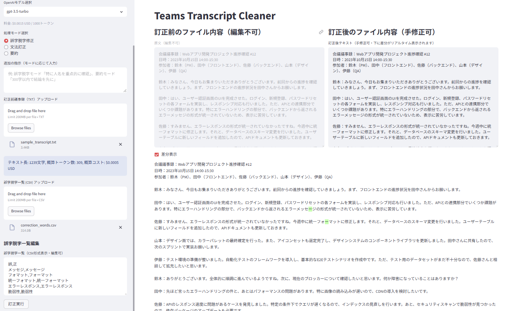
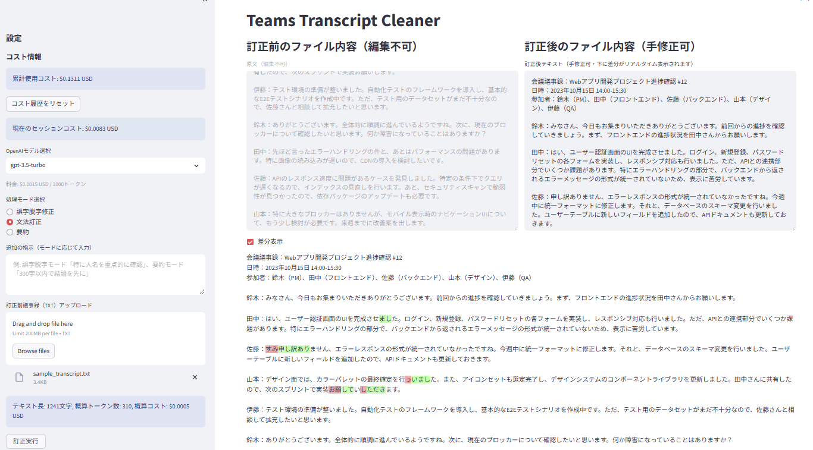

# TeamsTranscriptCleaner

## 概要

Microsoft Teams の自動生成トランスクリプト（議事録）は、しばしば漏字・脱字や誤字が含まれます。本ツール「TeamsTranscriptCleaner」は、アップロードされた議事録テキストと誤字脱字一覧（CSV）をもとに、OpenAI API を活用して高精度な訂正を行う Web アプリケーションです。主な目的は、会議記録の品質向上と、訂正作業の効率化です。

---

## 操作手順

本ツール「TeamsTranscriptCleaner」を使用して議事録を訂正する基本的な流れは以下の通りです。

1.  **アプリケーションの起動:**
    *   まず、コマンドラインで `streamlit run ui_components/app.py` を実行してアプリケーションを起動します。
    *   自動的にブラウザが開き、ツール画面が表示されます（表示されない場合は、コマンドラインに表示されるURLを手動で開いてください）。

2.  **APIキーの確認:**
    *   画面左のサイドバーにOpenAI APIキーに関する警告が表示されていないか確認してください。
    *   もし警告が表示されている場合は、先に進む前に環境変数 `OPENAI_API_KEY` を正しく設定する必要があります。設定方法は「セットアップ手順」を参照してください。

3.  **処理モードの選択:**
    *   サイドバーにある「処理モード選択」で、行いたい処理を選びます（例：「誤字脱字修正」、「文法訂正」、「要約」）。

4.  **議事録ファイルのアップロード:**
    *   サイドバーの「訂正前議事録（TXT）アップロード」ボタンを使って、訂正したいトランスクリプトのテキストファイルをアップロードします。
    *   アップロードが完了すると、ファイルの内容がメイン画面の左列「原文（編集不可）」エリアに表示されます。

5.  **（誤字脱字修正モードの場合）誤字脱字リストの準備:**
    *   「処理モード選択」で「誤字脱字修正」を選んだ場合は、誤字脱字リストを準備します。
    *   サイドバーの「誤字脱字一覧 (CSV) アップロード」ボタンから、予め用意したCSVファイルをアップロードできます。
    *   または、サイドバーの「誤字脱字一覧編集」テキストエリアに直接CSV形式（例: `誤,正` のヘッダーに続けて `古い単語,新しい単語`）で入力・編集することも可能です。

6.  **モデルとカスタムプロンプトの設定（任意）:**
    *   サイドバーの「OpenAIモデル選択」で、使用するAIモデルを選ぶことができます（モデルによって性能や料金が異なります）。
    *   必要に応じて、「追加の指示」欄に処理モードに合わせた具体的な指示を入力することで、AIの動作をカスタマイズできます。

7.  **訂正の実行:**
    *   サイドバー下部にある「訂正実行」ボタンをクリックします。
    *   処理には少し時間がかかる場合があります。処理中は進捗が表示されることがあります。

8.  **結果の確認と手修正:**
    *   処理が完了すると、メイン画面の右列「訂正後テキスト（手修正可）」エリアに結果が表示されます。
    *   内容を確認し、必要であればこのテキストエリアで直接手修正を加えることができます。
    *   「差分表示」チェックボックスをオンにすると、訂正前と訂正後のテキストの差異がハイライト表示され、変更箇所を確認しやすくなります。

9.  **（任意）訂正結果を元に再訂正:**
    *   訂正結果に満足できない場合や、さらに別の観点から修正を加えたい場合は、手修正したテキストを訂正前のテキストとして再度処理することができます。
    *   メイン画面下部の「訂正後テキストを訂正前にコピー」ボタンを押すと、右列のテキストが左列の「原文」エリアにコピーされます。その後、必要に応じて設定（モード、カスタムプロンプト、誤字脱字リスト等）を変更し、再度「訂正実行」を行ってください。

10. **最終結果のダウンロード:**
    *   満足のいく結果が得られたら、メイン画面下部の「最終確定ダウンロード」ボタンをクリックして、訂正済みの議事録をテキストファイルとして保存します。

**コストについて:**
OpenAI APIの利用にはコストが発生します。サイドバーの「コスト情報」で使用状況を確認できます。「コスト履歴をリセット」ボタンで累計コスト表示をリセットすることも可能です。

---

## フォルダ構成例

```
TeamsTranscriptCleaner/
├── ui_components/         # 画面入出力層（Streamlit等）
├── processing/            # 業務処理層（CSVパース・API連携等）
├── transcriptdata/        # サンプルデータ（テキスト・CSV）
├── requirements.txt       # 必要パッケージ
└──  README.md
```

---

## 要件整理

### 基本要件

- 入力：トランスクリプト（テキスト）、訂正単語集（CSV）
- 出力：訂正済み議事録
- UI：ファイルアップロード、訂正実行、結果表示・ダウンロード
- 訂正方法：OpenAI API ＋単語集
- セットアップ・実行手順・API キー設定方法・サンプルデータ利用方法も含めること

### モジュール要件

- UI 処理と業務ロジックの分離
- モジュール配置：`ui_components/`と `processing/`の分離
- インターフェース設計：明確なデータ構造定義
- テストコード実装：重要ロジックにはユニットテスト

---

## セットアップ手順

1. 必要なパッケージのインストール
   ```
   pip install -r requirements.txt
   ```
2. OpenAI API キーの設定
   - Windows 環境変数 `OPENAI_API_KEY` に設定してください
3. 設定ファイルの自動生成
   - 初回実行時に、以下の設定ファイルが自動的に作成されます。
     - `~/.teams_transcript_cleaner/` ディレクトリ
     - `~/.teams_transcript_cleaner/config.json`：APIの累計利用料金（`total_cost`）を保存します。
     - `~/.teams_transcript_cleaner/word_history.json`：過去に使用した最大10件の単語リストの履歴を保存します。
4. サンプルデータの利用
   - `transcriptdata/` フォルダ内にサンプルの議事録テキストと誤字脱字 CSV を配置しています。
   - テストや動作確認にご利用ください。

---

## 実行方法

1. Streamlit アプリの起動
   ```
   streamlit run ui_components/app.py
   ```
2. ブラウザで表示される画面から、
   - チェック対象の議事録や誤字脱字一覧を追加して「訂正実行」ボタンを押します。
   - 誤字脱字一覧は CSV 形式で直接編集・追加・変更できます。
   - 「訂正後テキストを訂正前にコピー」ボタンを押すと、訂正後テキストが訂正前にコピーされます。
   - 最終結果は「最終確定ダウンロード」ボタンからダウンロードできます。

---

## UI 詳細要件
- 誤字脱字修正モード

- 文法訂正モード

- 要約モード

---

- Streamlit を使用し、画面左側に設定用サイドバーを配置。メイン画面は左右2分割され、訂正前後のテキストなどが表示されます。
- 左側サイドバー上部に OpenAI モデル選択（コンボボックス、gpt-4o, gpt-4-turbo, gpt-4, gpt-3.5-turboなどを選択可能）
- 左側サイドバー上部にカスタムプロンプト入力欄（処理モードに応じた指示を入力）
- 左側サイドバーに訂正前の議事録（TXT 限定）アップロードボタン
- 左側サイドバーに誤字脱字一覧表示テキストエリア（CSV 形式表示・編集可、空の場合は「誤,正」をプレースホルダとして表示）
- 左側サイドバーに誤字脱字一覧（CSV 限定）アップロードボタン
- 左側サイドバー下部に訂正実行ボタン
- メイン画面の左列に訂正前の議事録（編集不可）、右列に訂正後の議事録（手修正可能なテキストエリア）を表示
- メイン画面のテキストエリア下部に差分表示のチェックボックスを配置し、チェックするとその下に詳細差分を表示
- メイン画面下部に、訂正後テキスト（右列）を訂正前テキスト（左列）にコピーするボタンを設置
- メイン画面下部に「最終修正結果をダウンロード」ボタン
- ユーザーが何度も OpenAI に再訂正を依頼できる運用を想定

---

## 工程分解・設計

### 構造設計

- モジュール分割：
  1. `ui_components/`：画面入出力層
     - `ui_components/app.py`：Streamlitアプリケーションのエントリーポイント。UIの構築、ユーザーからの入力処理、結果の表示を行う。
        - ファイルアップロードハンドラ：議事録テキストファイルと誤字脱字一覧CSVファイルのアップロードを処理する。
        - モデル選択 UI：OpenAIモデルを選択するためのUIを提供する。
        - プロンプトカスタマイザ：OpenAI APIへの指示をカスタマイズするためのUIを提供する。
        - 結果表示リーダー：訂正前後のテキストを表示し、差分表示機能を提供する。
  2. `processing/`：業務処理層
     - `processing/csv_parser.py`：CSVファイルを読み込み、誤字脱字リストを解析する。
        - `parse_csv_text()`：CSV形式のテキストから誤字脱字リストを解析し、辞書のリストとして返す。
     - `processing/openai_api.py`：OpenAI APIとの通信を処理し、テキストの訂正を行う。
        - `correct_text()`：OpenAI APIを使用してテキストを訂正し、訂正後のテキストと使用コストを返す。
     - `processing/token_manager.py`：OpenAI APIのトークン数を管理する。
        - `count_tokens()`：テキストのトークン数を概算する（簡易的な文字数ベースの推定）。
        - `split_text()`：テキストをトークン数制限に基づいて分割する（段落や文単位での分割を試みる）。
        - `estimate_cost()`：APIリクエストの概算コストを計算する。
        - `get_max_tokens_for_model()`：モデルの最大トークン数を取得する。
     - `processing/api_key_manager.py`：OpenAI APIキーを管理し、APIの使用コストを追跡する。
        - `get_api_key()`：環境変数からAPIキーを取得する。
        - `load_config()`：設定ファイルを読み込む。
        - `update_cost()`：使用コストを更新する。
        - `get_total_cost()`：累計コストを取得する。
        - `reset_cost()`：コスト履歴をリセットする。
        - `save_word_list(name, words)`：指定された名前で単語リストを保存します（最大10件まで保持し、古いものから置き換えられる可能性があります）。
        - `get_word_lists()`：保存されている単語リストの一覧を取得します。
        - `delete_word_list(name)`：指定された名前の単語リストを履歴から削除します。
        - これらの関数により、ユーザーは頻繁に使用する修正用CSVデータのコレクションを管理できますが、現在の `app.py` のUIでは、これらの保存/読み込み/削除機能はまだ直接提供されていないようです。

---

## 開発ロードマップ

- まず最小限のプロトタイプ（アップロード → 訂正 →DL）
- 差分表示など機能拡張
- UI/UX 改善、保守・運用体制整備
- 複数ユーザー対応

  - ユーザー認証機能の追加
  - ユーザーごとの設定保存
  - 単語集の共有機能
  - 権限管理（管理者/一般ユーザー）
