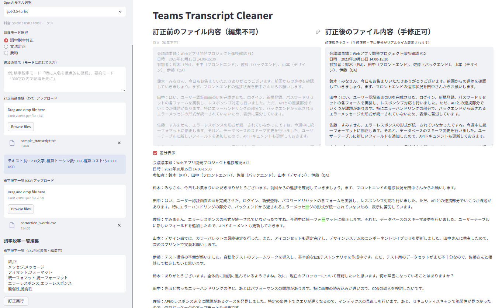
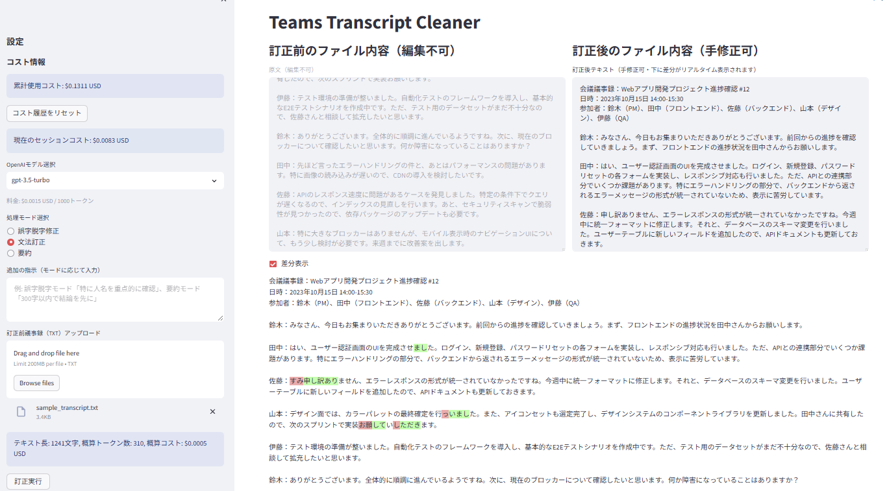
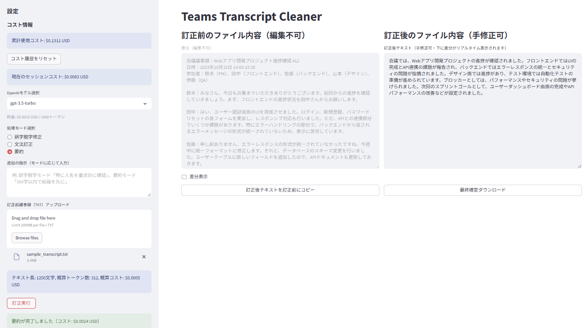

# プロダクトの背景

Microsoft Teams の自動生成トランスクリプトは、会議の内容を記録するために非常に便利ですが、しばしば漏字・脱字や誤字が含まれます。

## 解決する問題

- Teamsのトランスクリプトの可読性の向上。
- トランスクリプトのクリーニング処理の効率化。
- ユーザーが自分のニーズに合わせてトランスクリプトをカスタマイズできるようにすること。

## UI 詳細要件

- 誤字脱字修正モード
  
- 文法訂正モード
  
- 要約モード
  

---

- Streamlit を使用し、画面を左 3 割・右 7 割で分割
- 左側上部に OpenAI モデル選択（コンボボックス、料金のかからない最近の 5 モデルのみ）
- 左側上部にカスタムプロンプト入力欄（デフォルト：漏字脱字訂正優先、日本語文法訂正は次、意思齟齬は禁止）
- 左側に訂正前の議事録（TXT 限定）アップロードボタン
- 左側に誤字脱字一覧表示テキストエリア（CSV 形式表示・編集可、アップロード直後はプレースホルダ表示）
- 左側に誤字脱字一覧（CSV 限定）アップロードボタン
- 左側下部に訂正実行ボタン
- 右側上部に訂正前後の内容表示（訂正後は手修正可能なテキストエリア）
- 右側中部に差分表示のチェックボックスを配置し、クリックして下部に詳細差分を表示
- 右側下部の訂正後テキストを右上の訂正前テキスト欄にコピーするボタンを設置
- 右側下部に「最終修正結果をダウンロード」ボタン
- ユーザーが何度も OpenAI に再訂正を依頼できる運用を想定
---
