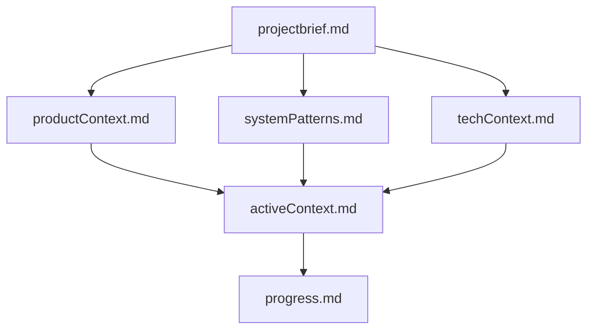

# プロジェクト概要

このプロジェクトは、Microsoft Teams の自動生成トランスクリプト（議事録）の品質を向上させるためのツールです。

## 目的

- Teamsのトランスクリプトから不要な情報を削除し、より読みやすくすること。
- クリーニングされたトランスクリプトをさまざまな形式で出力できるようにすること。

## 目標

- ユーザーが簡単にトランスクリプトをクリーニングできるGUIアプリケーションを作成すること。
- クリーニング処理を自動化するためのCLIツールを提供すること。
- さまざまなカスタマイズオプションを提供し、ユーザーが自分のニーズに合わせてクリーニング処理を調整できるようにすること。

## ドキュメントの関連性

